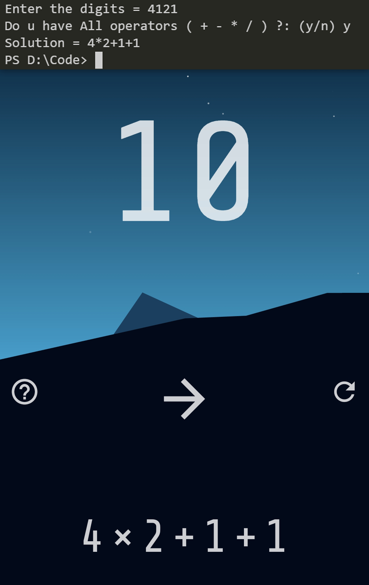

# 4=10 Game Solver
```
Enter 4 digit number and the program will Automatically print out
the solution how those 4 digits can make 10.
```
<br>
# links
4=10 Game
[App Link](https://play.google.com/store/apps/details?id=app.fourequalsten.fourequalsten_app)
<br>
<br>
Publisher: Sveinn Steinarsson 
<br>
Platform: Android
<br>
<br>
<br>
-PYTHON CODE 
<br>
-No additional dependencies needed
<br>
<br>

<br>

